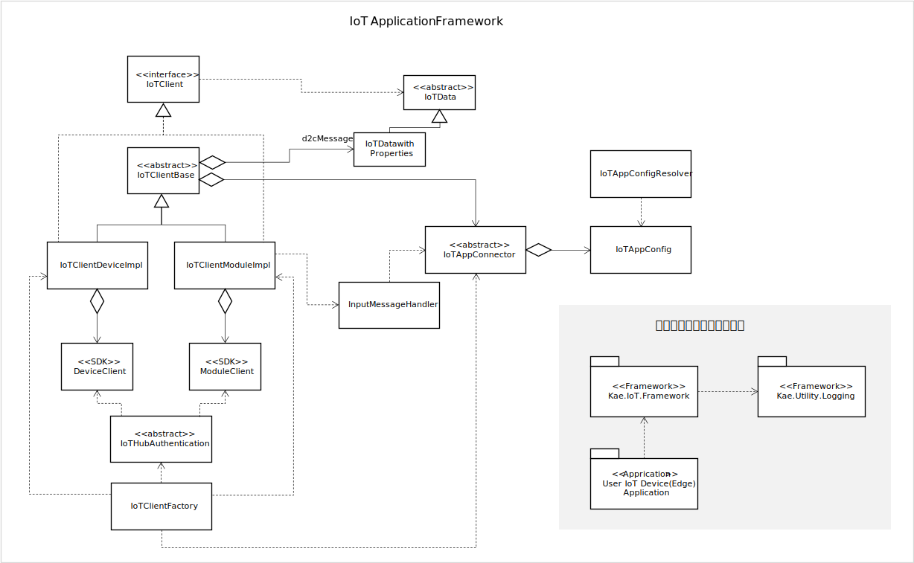
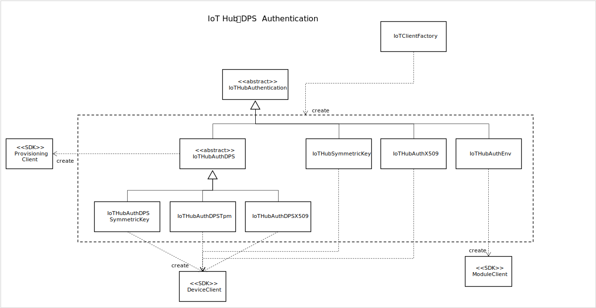
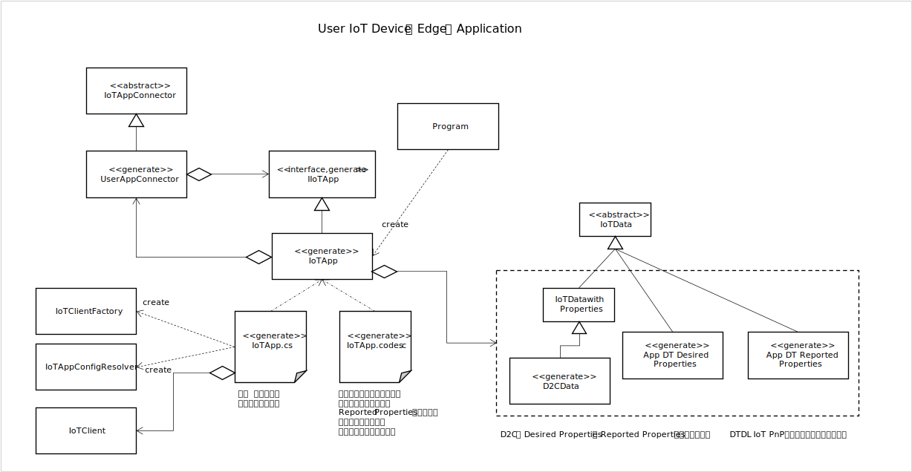

# C# 用 フレームワークライブラリ  
- Framework Library - [./Kae.IoT.Framework/](Kae.IoT.Framework/)
- Device Application 形式のサンプル - [./SampleIoTFWDeviceApp](SampleIoTFWDeviceApp)
- Service 形式のサンプル - [./SampleIoTFWServiceApp](SampleIoTFWServiceApp)
- Edge Modle 形式のサンプル - [./SampleModule](SampleModule)

## 要件  
以下の3つの実行形式で利用可能とする。  
- 通常のアプリケーションで実行
- バックグラウンドでシステムのサービスとして実行
- Docker Container(IoT Edge Module)として実行  

以下のプラットフォームで実行可能とする。  
- Windows
- Linux  

Azure IoT Hub が提供するデバイス接続に関するセキュリティは、Symmetric Key と X509 をサポートする。Azure IoT Hub だけでなく、Device Provisioning Service もサポートする。こちらは、TPM もサポートする。  
手書き、自動生成の両方で利用可能とする。  
定型的なコードは可能な限りフレームワークライブラリに含める。  
それぞれの実行形式、プラットフォームで流儀がある場合、可能な限り従う。  
本ライブラリは、実プロジェクトでも利用可能なレベルの実装を目指す。

## 設計・実装  
Windows、Linux 双方で動作可能にするため、.NET Core を使ってライブラリを開発する。  
IoT Edge Module は、コード記述上の Warning をコンパイルエラーとする設定になっているが、実用上、問題のない範囲でその制限を緩めている。また、VS Code や Visual Studio 向けの Azure IoT Edge 用の Toolkit が生成するプロジェクトは、netcoreapp3.1をベースにしており、最新の.NET 5.0 用の Docker のベースイメージがないため、本ライブラリもnetcoreapp3.1をベースにビルドすることにする。  
接続に必要な接続文字列や証明書情報、プロトコル等は、iot-app-config.yaml という設定ファイルに記述し、ユーザーアプリの実行時に読み込むこととする。

名前空間は、Kae.IoT.Framework とする。  
実プロジェクトでも利用可能なレベルとは、とどのつまり、エラー処理がきちんと実装されている事である。2022/5/2時点では、未だエラー処理は不十分な状態ではあるが、最低限、上手く動作しなかった場合に原因調査を行うためのログ機能は実装している。  
ロギング機構の名前空間は、Kae.Utility.Logging とする。  

本ライブラリのクラスダイアグラムを参考までに図示しておく。  

Azure IoT Hub、Device Provisioning Service の認証に対応するライブラリを以下に図示する。  

これらのフレームワークライブラリを使って、各ユーザーの IoT デバイスのアプリケーションを実装する場合のパターンを図示する。  

バックグラウンドのシステムサービスとして実行する場合は、Worker というクラスを使う。  
IoT Edge Module の場合は、前述のとおり、Warning に対するコンパイルエラー処理が厳しいので、若干、IoTData 型の利用を工夫している。  

C# のクラス定義には、partial キーワードがあり、一つのクラスの継承、実装、及び、メソッド等の宣言、定義を複数のファイルに分割可能なので、ユーザーが必要なロジックを実装、及び、更新する際に、限定されたファイルのみが編集されるようにできている。  

図示したクラス図の作成タイミングは、一通り、フレームワークライブラリのコードの実装を終えて基本的なテストを行った後である。モデリング原理主義的なやり方では、きっちりとクラス図を書いてから実装を行う方が良いと考えるのかもしれないが、実践的ではないのでやめた方が良い。今回は教本的な内容に近いので、PowerPointでクラス図を書いている（非常に苦痛）が、Visual Studio には、既存のコードからクラスダイアグラムを自動生成する機能があるので、クラス図が必要な場合は、その様なツールを使う事をお勧めする。  

参考までに本ライブラリの作成過程を書いておく。多分この流れが最も実践的な作業工程と思われるので、参考にしてほしい。  
1. 情報収集や関連する技術情報の確認  
1. フレームワークの要件を検討
1. フレームワークを構成するクラス群の大枠のスケッチ
1. フレームワークライブラリの実装
1. ユーザーアプリのサンプルコードの作成と実行テスト
1. フレームワークライブラリの見直し 
大体、こんな流れで開発を行っている。4.以降は何度も繰り返し行うことになる。人によっては、一度書いて動いたコードを修正する事に躊躇するのかもしれないが、クラス名や構成にそぐわない実装が出てきたり、双方向依存だったり、その他諸々の不具合が出てきた場合は、臆せずリファクタリングをするべきである。特に、フレームワークライブラリの場合は、リリース後に多数の他人が利用するのであり、フレームワーク開発者が手抜きをしたことによって生じる実装上の時間的ロスは、一回当たりのロス×利用回数となり、それに比べれば、フレームワーク開発者が問題解決にかける時間はゼロに等しい。  

実際に発生したリファクタリングの一例を挙げておく。  
当初、IoTHubAuthentication(の実装クラス) が iot-app-config.yaml を解釈し、IoTClient インスタンスを生成するようにしていた。当初 Device Provisioning Service の存在は忘れており、途中で気がつき追加。この時点で IoTHubAuthentication という名前はいかがなものかと懸念が上がったが、所詮、Device Provisioning Service → IoT Hub という流れの接続なので、まぁいいだろうと。その後、IoT Edge Module の外部からのデータ受信の際のインプットポートの名前をどうするか、ということで、インプットポートの名前を設定ファイルに入れることにした。この時点で、この情報は、IoT Hub の Authentication ではないなと、いうことで、IoTAppConfig、IoTAppConfigResolver というクラスを分離し、関連するクラス群の構造を見直ししている。  
他には、DeviceClient と ModuleClient を利用側から同じように見える様にしている IoTClient クラスとユーザー側のコードをどうつなぐか、ここについては、何回か試作して試して、依存性の低減や使い勝手向上の観点で、見直しを何度かしている。  

作業工程の最初のステップの「情報収集や関連する技術情報の確認」は、単にドキュメントを読むだけでは不十分であり、プロトタイプ的に実際に動く小さなコードを作成して実行して試して見るのが一番手っ取り早い。  
一般的に提供されているサービスや技術は、全ての細かな仕様がドキュメント化されているわけではなく、動かしてみて初めて分かることも多々ある。ビジネス支援システム開発においては、ベースとなるツールやサービスは本質ではないと考える人もいるかもしれないが、すべて自前で開発するなら別だが、第三者が提供するサービス等を利用するなら、利用するものにある程度規定されてしまうのは仕方がない。動くコードを書かずに、システム要件を詰めていくことは時間の無駄である。  

フレームワークを第三者に提供する場合、そのフレームワークの使い方を記述したドキュメントは必須となる。加えて、実際に動作可能なサンプルも必要である。  
C# や Java 等、強い型付け言語でかつ、高級言語であれば、言語仕様を駆使して、開発者が想定する使い方を、ユーザーに対してある程度強制することは可能ではあるが、100％正しく使わせる事を強制するのは無理であろう。  
ユーザーは、各自の状況や必要に応じて、ありとあらゆるアドリブをしてくるものである。  
文章によるドキュメントには限界があり、フレームワークの正しい使い方を文書化するのはとても難しい。また、ここで紹介している小規模なフレームワークライブラリですら、きちんとしたドキュメントを作れば、結構なボリュームになるであろうし、通常の大規模なフレームワークであれば、立派な長編になってしまい、読んで理解するのに多大な時間が必要になってしまう。たとえ、素晴らしいドキュメントを作ったとしても、それが正しくユーザーに伝わるかは、ユーザー自身の責任によるところも大きい。  
一つの解決策として有効なのは、ユーザーアプリコードの自動生成である。どんなに素晴らしい出来のフレームワークライブラリでも、定型コードや定型的な作業は生じてしまうものである。定型的な部分は可能な限り自動化し、自動化ツールに利用ルールの大半を埋め込み、ユーザーが理解しなければならない項目を最小化することによって、ドキュメントも最小化され、ユーザーの作業も最小化する。  
加えて、自動生成の仕組みを検討することにより、フレームワークライブラリ自体も、より洗練されるという副次効果が得られる。  
自動化の仕組みを開発する技術者は、自動生成対象のプログラミング言語をより深く理解する機会にもなるので、是非、挑戦していただきたい。  

